# CryptoApp

Native Android Application using Views + Jetpack Compose with Wearable support.

### Screenshots

 
 
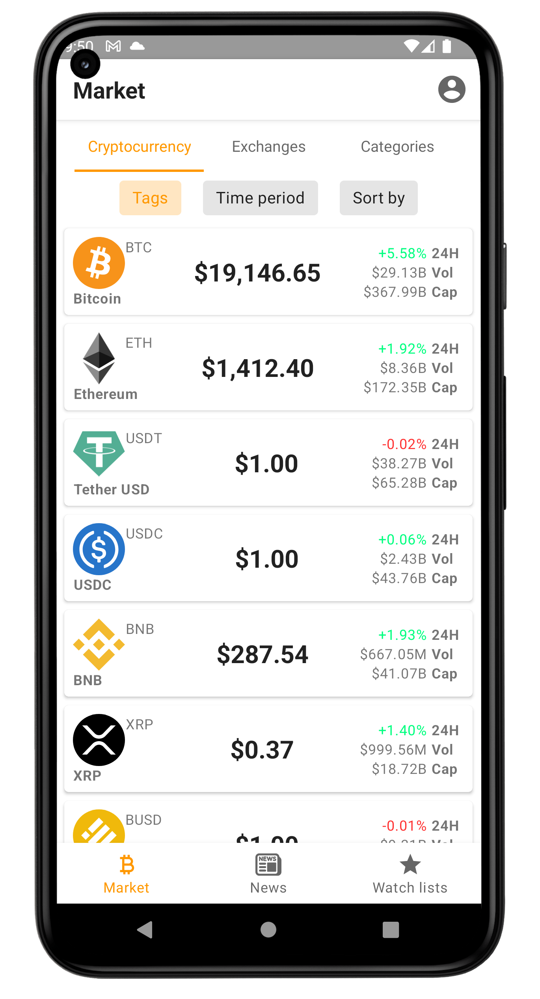 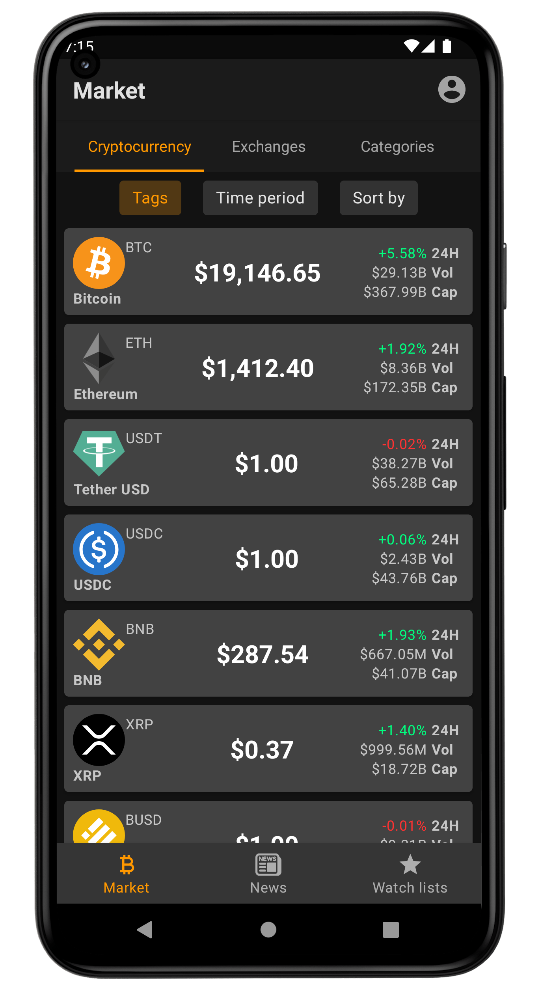
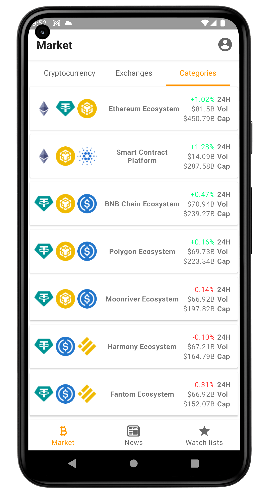 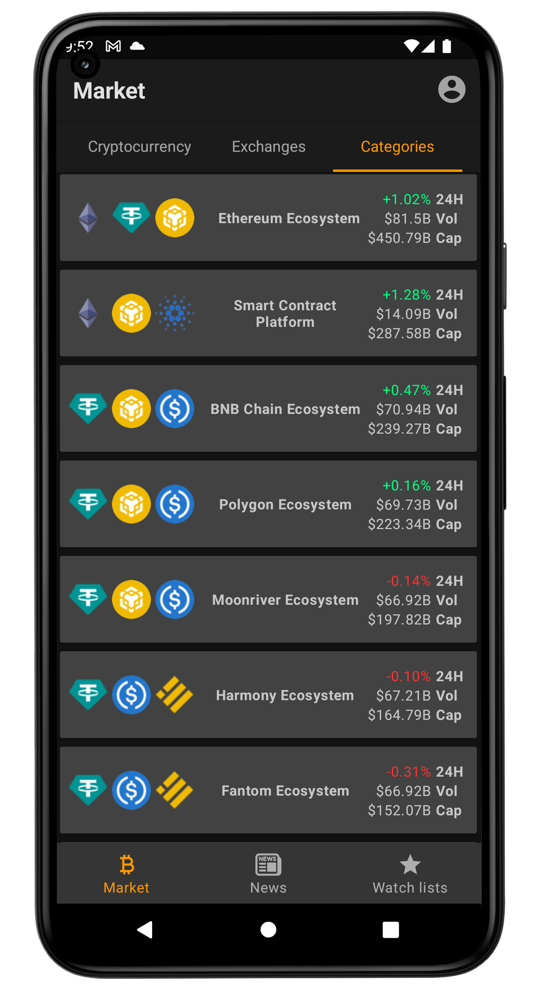
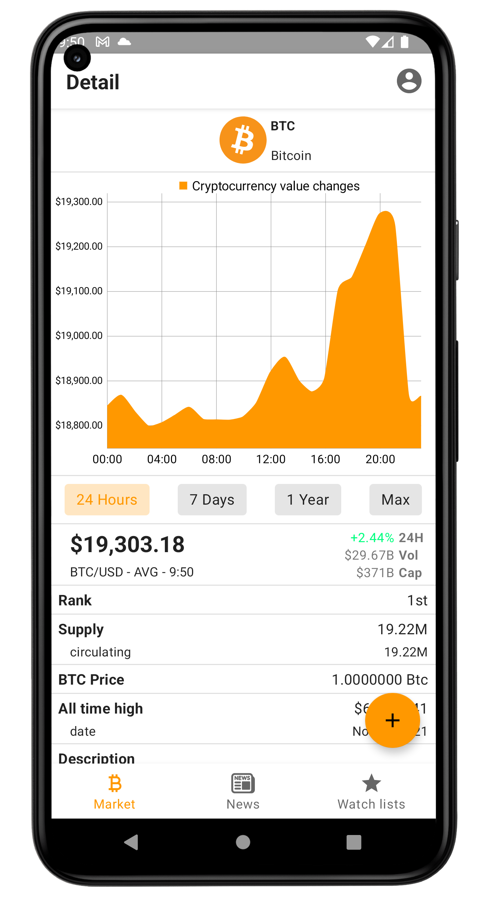 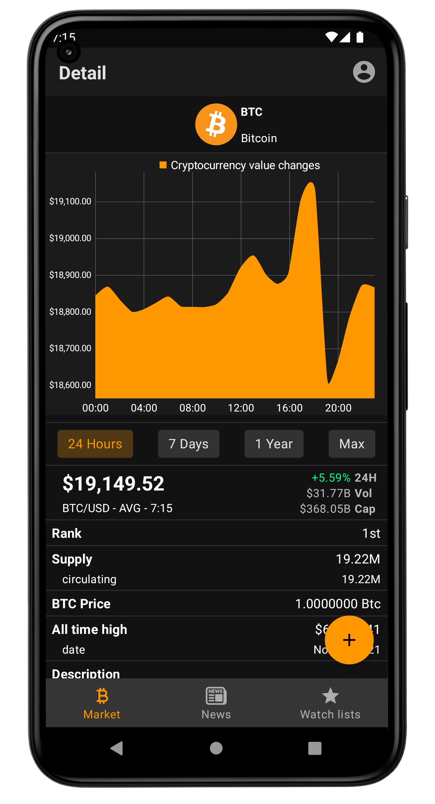
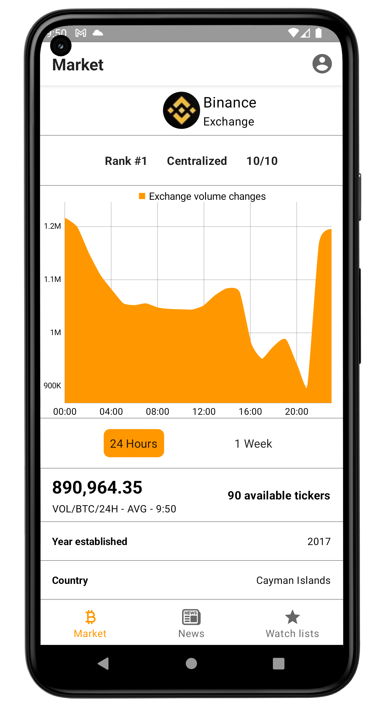 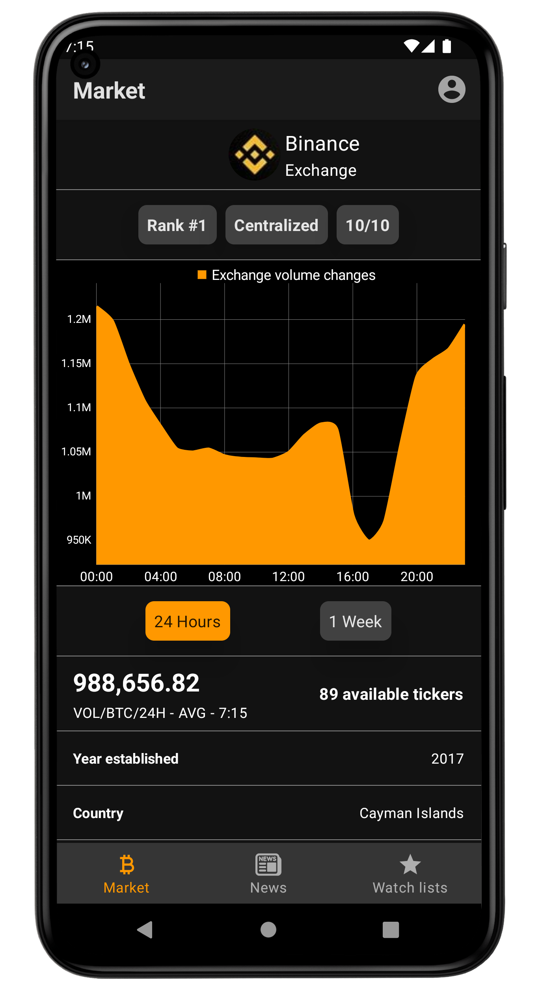
 
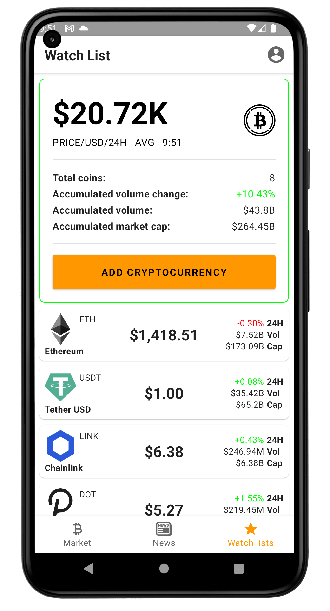 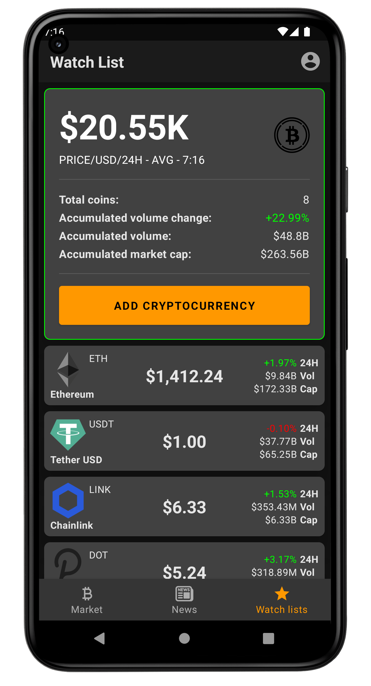
 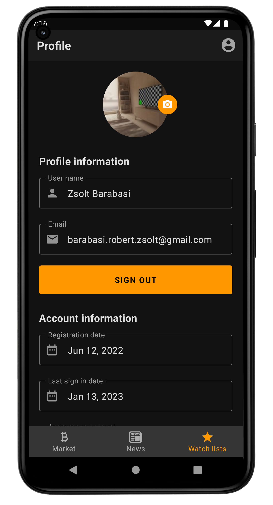

### License

This software is licensed under GNU GPL 3.0. Any derivative works must follow the same open-source license. 